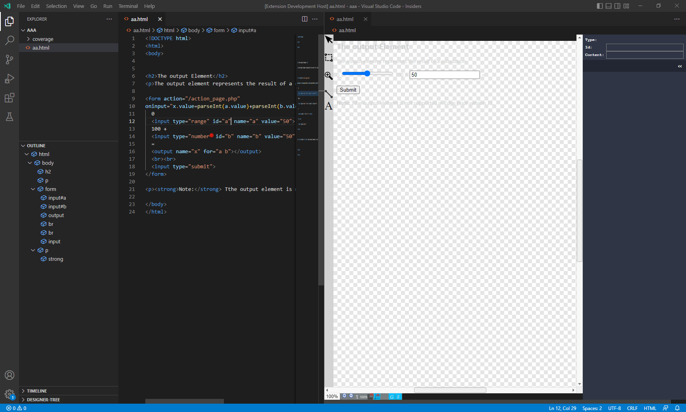

# vs-code-designer-addon
A VSCode Addon using the web-component-designer

## references

- based on https://github.com/node-projects/web-component-designer
- sample using the designer: https://node-projects.github.io/web-component-designer-demo/index.html

## sample image

## Open the Designer

- Rightclick on a HTML File and Select "Open With", here select "Designer"

## Development

- Clone this Repository
- Open the Cloned Repository in VS Code 1.47+
- `npm install`
- `F5` to start debugging

