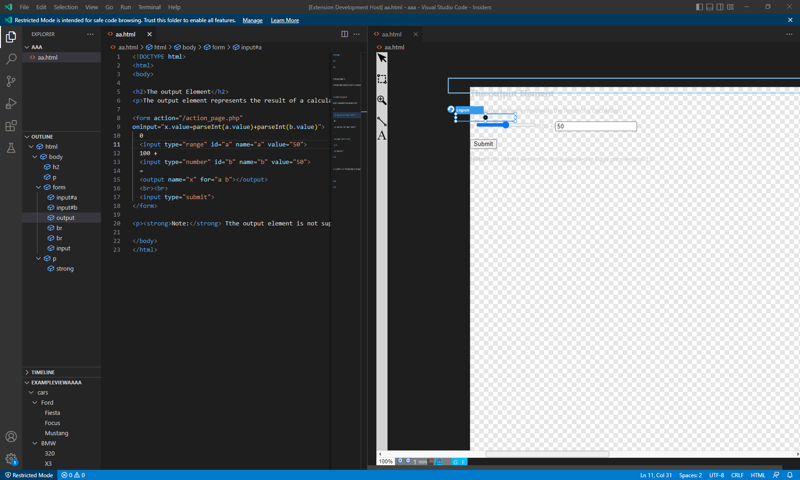

# vs-code-designer-addon
A VSCode Addon using the web-component-designer

## sample image

## Running the example

- Open this example in VS Code 1.47+
- `npm install`
- `npm run watch` or `npm run compile`
- at the moment you also need to watch `npm run watchWebview`
- `F5` to start debugging

Right Click HTML File and select open with, then choose designer

